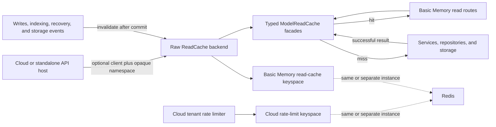

# Redis Read Cache Plan

## Status

Accepted implementation plan. Basic Memory owns semantic read caching; Basic Memory Cloud owns
tenant and principal rate limiting. The datasets are logically isolated even when they share a
Redis instance.

## Goals

- Reduce latency and database work for repeated entity and note reads.
- Keep Redis optional so the default local-first installation has no external service
  requirement.
- Make cache semantics, typed serialization, TTLs, and invalidation part of Basic Memory.
- Let a host such as Basic Memory Cloud inject an existing Redis client and opaque namespace.
- Preserve independent key prefixes, metrics, ownership, and failure behavior for read caching
  and rate limiting.

## Ownership Boundary

Basic Memory owns:

- cacheable read operations;
- canonical request keys;
- typed serialization;
- TTL and payload-size policy;
- project-scoped invalidation;
- the model-bound read-through facade and Redis read-cache implementation.

Cloud owns:

- tenant and principal identity;
- rate-limit policy and enforcement;
- the Redis deployment topology;
- the opaque cache namespace supplied to Basic Memory;
- capacity, eviction, and availability decisions when Redis is shared.

Physical topology is deliberately outside the Basic Memory cache contract. Cloud may point the
read cache and limiter at separate Redis instances or clients, or reuse one client and connection
pool when both concerns share an instance.

### Tenant isolation on shared Redis

Cloud does not create a Redis instance or connection pool per tenant. It reuses one long-lived
Redis client and connection pool and constructs a lightweight `RedisReadCache` adapter from
trusted request or worker context:

- `namespace`: the stable tenant/workspace UUID;
- `project_id`: the Basic Memory project external UUID;
- `prefix`: the Basic Memory read-cache keyspace, separate from rate limiting.

The adapter hashes `(namespace, project_id)` into the Redis Cluster scope. Two tenants with the
same project identifier therefore cannot share a generation or data key. Tenant isolation must
not rely on project UUID uniqueness alone: every Cloud read and invalidation supplies the
authenticated tenant/workspace UUID, even when project UUIDs are globally unique in practice.

The namespace is host-owned isolation context, not an API input. Never derive it from a display
name or slug, accept it from a caller, or include API keys and other secrets in it. API requests
and background workers must use one canonical tenant-to-namespace function so an index worker
invalidates the exact scope populated by the request path.

### Cloud host requirements

Basic Memory Cloud must satisfy all of these requirements when composing cached reads:

1. Derive one stable namespace from authenticated Cloud context. The preferred value is the
   tenant UUID or workspace UUID already owned by Cloud. Project UUID alone is not a tenant
   boundary, even if current database constraints make it globally unique.
1. Complete authorization and tenant database/schema selection before cache lookup. The
   namespace prevents key collisions; it does not replace Cloud's access-control boundary.
1. Override the low-level `get_read_cache` dependency at the Cloud composition root. Construct
   `RedisReadCache(client=shared_redis_client, namespace=trusted_namespace)` as a lightweight
   request-scoped adapter; reuse the long-lived client and connection pool. A single Cloud
   composition function owns this choice so the cache can move to a separate client or instance
   later without changing Basic Memory routes or workers. FastAPI route dependencies then create
   lightweight `ModelReadCache` facades from that shared backend and bind Basic Memory's response
   type, TTL, and payload-size policy. Cloud should not duplicate those policy constants or
   construct Redis clients per response model.
1. Pass the trusted tenant/workspace identity through internal queue payloads, or include enough
   trusted identifiers for workers to derive the exact same namespace. Never copy a namespace
   from a public request field.
1. Inject the namespace-bound cache into every mutation-producing runtime: accepted note
   materialization, object-storage events, direct and project indexing, directory moves/deletes,
   watcher-detected paired moves, relation-resolution workers, and startup recovery or
   reconciliation. Request-path invalidation alone is insufficient because a worker can update a
   cached entity after the request returns.
1. Invalidate after semantic vector publication, including partial-failure paths. Vector sync can
   run after the mutation and file-index generation bumps, so VECTOR/HYBRID responses filled while
   embeddings are stale must not survive the later derived-state update. Queue-backed Cloud vector
   workers use the same trusted tenant namespace and canonical project UUID as request reads.
1. Treat each asynchronous state transition as a separate freshness boundary. Invalidate after
   the accepted-note transaction commits, immediately after terminal materialization/status
   publication before indexing begins, again after indexing, and again after relation resolution
   completes. This prevents a read filled between phases from surviving the later worker commit
   or remaining pending throughout a slow index.
1. Make committed-mutation invalidation cancellation-safe. Accepted-note writes, directory
   deletion, and each file in a directory move can be cancelled after their database commit
   succeeds but before the transaction context returns. Finish the namespace-bound generation
   bump before re-propagating cancellation so committed state cannot remain hidden behind the
   previous generation.
1. Invalidate after each committed project-index move, delete, and file-index batch, while
   retaining the final failure-safe completion boundary for later-phase errors. Local inline file
   batches invalidate when their runner returns; queued Cloud file batches invalidate in the child
   worker after its durable commit, not merely when the coordinator enqueues the job.
1. Put full search reindexing in a failure-safe invalidation scope owned by the worker that runs
   the rebuild. Reindexing drops and repopulates search rows incrementally, so fuzzy resolutions
   filled during a partial or completed rebuild must not survive its final generation bump.
1. Put direct single-file and watcher file-index invalidation in failure-safe boundaries. Entity
   transactions can commit before search refresh or note-content reconciliation raises, so a
   failed index attempt can still publish cache-relevant state. Wrap the transaction-bearing
   watcher index and entity-delete operations themselves in cancellation-safe invalidation because
   cancellation can land during transaction exit before their completion callbacks run. Once a
   watcher callback runs, retain its generation bump before relation and search cleanup.
1. Pass the namespace-bound cache into hosted note-content read repair. A resource or entity read
   can bootstrap a missing accepted-content row. Put cancellation-safe invalidation around the
   transaction-bearing repair call, not only after it returns, so cancellation during transaction
   exit still advances the generation before the repaired response can reach read-through
   storage.
1. Pass the namespace-bound cache into pre-mutation content freshening. Freshening can index an
   externally edited file before the accepted mutation begins, so invalidate after every
   freshening attempt that may have published state, including when the later mutation is
   rejected or raises.
1. Inject the namespace-bound cache into import endpoints and workers. Invalidate after every
   attempted file write before the next item, including writes that raise after partial progress,
   and retain the final failure-safe invalidation around the complete import attempt.
1. Invalidate directory deletion immediately after its acceptance transaction commits, then
   again after file cleanup and surviving-relation refresh. A slow or failed cleanup must not
   keep deleted entities reachable through the pre-acceptance generation.
1. Invalidate every committed watcher-detected move batch, then retain the final invalidation
   after search refresh. Paired delete/create events are consumed by move processing and therefore
   bypass the ordinary watcher callbacks; a large watcher run commits bounded batches before the
   final refresh.
1. Invalidate directory moves after each individual file/database move commits, then again after
   the final search and relation follow-ups. Directory moves are incremental batches, so a long or
   partially failed request must not keep earlier files under the pre-move generation.
1. Inject the namespace-bound cache into project-root path mutations. A root change preserves the
   project and entity UUIDs while changing the filesystem source behind resource reads, so
   invalidate in a failure-safe boundary around the committed path update.
1. If startup recovery or reconciliation attempts can publish materialization, vacate, index, or
   relation state, invalidate through the same namespace-bound cache before releasing the serving
   barrier or resuming tenant traffic. Treat materialization and move-vacate recovery as separate
   freshness phases: invalidate a completed first phase before starting the second so a later
   setup/query failure cannot skip the earlier generation bump. Terminal conflict and failure
   publication count even when the recovery did not produce a written file. Put each
   transaction-bearing phase inside a cancellation-safe invalidation scope so shutdown cannot
   interrupt the generation bump after recovery commits.
1. Keep `bm:read:v1` separate from rate-limit and Cloud control-plane prefixes, metrics,
   timeouts, and failure policies. The clients may target one Redis deployment, but a read-cache
   timeout must bypass while a rate-limit decision keeps its Cloud-owned security behavior.
1. Activate request reads and worker invalidation together in the same Cloud release, using the
   same namespace function. The cache is fail-open and TTL-bounded, so do not add tenant cohorts,
   shadow reads, or a second rollout switch; use integration coverage and cache telemetry to
   verify the direct activation.
1. Coordinate rolling deployments around the `bm:read:v1` payload/key contract. Bump the prefix
   for incompatible serialized response changes so mixed application versions never interpret
   one another's payloads with different schemas.

If Cloud ever changes the namespace source, treat that as a cache-key migration. A new namespace
is safe because it cannot read the old tenant scope, but old keys remain until their TTLs expire
and every worker must switch atomically enough to avoid missing invalidations.

## Architecture



## Core Contract

Introduce `src/basic_memory/read_cache/` with:

- a narrow `ReadCache` protocol;
- a narrower `ReadCacheInvalidator` protocol for mutation and repair paths;
- immutable request/key values;
- canonical key construction;
- a generic `ModelReadCache[ModelT]` facade that owns one Pydantic response type and policy;
- an optional `RedisReadCache` adapter.

The raw backend is namespace-bound at construction. Its public operations are:

- `lookup(key)`, which returns the generation observed with a hit or miss;
- `store(key, lookup, payload, ttl)`, which reports stored or superseded;
- `invalidate_project(project_id)`.

Cloud can create a lightweight namespace-bound adapter around a long-lived, Basic
Memory-specific async Redis client. Basic Memory then creates separate model-bound facades for
entity, resolution, and resource responses over that same adapter. Facades do not own clients or
connections. Basic Memory does not receive tenant, subscription, or rate-limit concepts.

## Keys And Invalidation

Use versioned, cluster-compatible keys:

```text
bm:read:v1:{scope_digest}:generation
bm:read:v1:{scope_digest}:<operation>:<request_digest>
```

`scope_digest` hashes the host-supplied tenant/workspace namespace and project external ID. The
Redis Cluster hash tag keeps that tenant-project scope's generation and data keys in one slot.

Each value records the random generation token under which it was created:

1. Read the generation and data key together.
1. Accept the cached value only when its embedded generation matches.
1. After a successful mutation commit, replace the generation with a new random token.
1. Give generation metadata a bounded TTL, renew it to at least each stored response's remaining
   lifetime, and reset that TTL on invalidation. A lookup also migrates a legacy persistent
   generation key to a bounded TTL.
1. Let unreachable entries and inactive-project generation metadata expire; never scan or
   bulk-delete keys.

Random tokens prevent an evicted generation key from returning to an old integer generation and
reviving stale data. A read that fills after concurrent invalidation also remains safe because its
old token no longer matches.

## Cache Surface And Production TTL

Phase one:

| Operation                   | Production TTL | Constraints                                         |
| --------------------------- | -------------: | --------------------------------------------------- |
| Entity by external ID       |    300 seconds | Cache validated `EntityResponseV2` JSON             |
| Identifier resolution       |    300 seconds | Include body and workspace context                  |
| Markdown note resource      |    300 seconds | Cache only below an explicit size limit             |
| Directory structure         |    300 seconds | Folder-only tree; two MiB payload cap               |
| Directory tree              |    300 seconds | Full hierarchy; two MiB measured payload cap        |
| Paginated directory listing |    300 seconds | Include path, depth, glob, page, and page-size keys |

Additional measured surfaces:

| Operation                   | Production TTL | Constraints                                     |
| --------------------------- | -------------: | ----------------------------------------------- |
| Search                      |     30 seconds | Implemented; complete query plus pagination key |
| Context and recent activity |  15-30 seconds | Future; normalize or bound time-relative inputs |

Do not initially cache failures, missing entities, graph/orphan responses, large or arbitrary
binary resources, schema inference, writes, or Cloud control-plane data.

Caching is semantic rather than HTTP-method based. The POST identifier-resolution and search
operations can be cached without changing their public API. Identifier resolution depends on the
request-local workspace permalink context, so its request digest includes the workspace slug and
workspace type in addition to the validated request body.

## Placement

Cache typed boundary values rather than SQLAlchemy models. Use an explicit read-through scope in
the API routes so hit, miss, serialization, and fallback behavior remain visible. FastAPI injects
a route-specific `ModelReadCache[ResponseType] | None`; its provider binds the optional backend
to Basic Memory's response type, TTL, and payload-size policy at the dependency boundary. Routes
keep the authoritative read inline inside a Python async context manager instead of constructing
loader callbacks:

```python
cache_key = ReadCacheKey(
    project_id=project_external_id,
    operation=ReadCacheOperation.entity,
    request_digest=read_cache_request_digest(entity_id),
)
cache_scope = (
    read_cache.read(key=cache_key)
    if read_cache is not None
    else nullcontext(ReadCacheScope[EntityResponseV2]())
)
async with cache_scope as cached:
    if cached.value is not None:
        return cached.value

    entity = await entity_repository.get_by_external_id(session, entity_id)
    result = EntityResponseV2.model_validate(entity)
    cached.value = result
    return result
```

The context manager performs lookup before entering the body and stores an eligible miss when the
body exits normally. Exceptions and cancellation propagate without storing. When no backend is
configured, callers do not invoke cache lookup, store, or invalidation; there is no disabled cache
result or no-op implementation. A route that performs read repair passes the model-bound facade
itself through the narrow `ReadCacheInvalidator` capability when present; it never reaches through
the facade to a Redis/backend attribute.

Mutation and indexing code uses the same direct scope pattern when invalidation is unconditional:

```python
async with invalidate_cache(read_cache, project_id):
    await importer.import_data(...)
```

Callers enter this scope only when a backend is present. Conditional and multi-phase invalidation
remains explicit so the freshness boundary is visible. The scope finishes its generation bump
before re-propagating cancellation, which makes it safe around operations whose transaction can
commit during async context-manager exit.

Primary integration points:

- `src/basic_memory/api/container.py`
- `src/basic_memory/api/app.py`
- `src/basic_memory/deps/read_cache.py`
- `src/basic_memory/api/v2/routers/directory_router.py`
- `src/basic_memory/api/v2/routers/knowledge_router.py`
- `src/basic_memory/api/v2/routers/resource_router.py`
- later, `src/basic_memory/api/v2/routers/search_router.py`

Invalidation belongs at portable mutation and indexing completion boundaries, not only in
FastAPI routes. It must cover accepted note writes, terminal deferred materialization and status
publication, direct file indexing, filesystem watcher updates, project indexing, directory
mutations, imports, watcher-detected paired moves, startup recovery or reconciliation, Cloud
storage events, full search reindexing, and relation-resolution changes that affect cached
responses. Each later phase invalidates again so a value filled after an earlier generation bump
cannot outlive the state that phase publishes. Hosted read repair invalidates after bootstrapping
accepted content and before a repaired entity or resource is stored, including cancellation
during the repair transaction's exit. Directory moves invalidate after every committed file plus
the final reindex; directory deletion invalidates after acceptance and after cleanup. Imports
invalidate after every attempted file write and again around the complete attempt so partial
failures cannot escape. Project indexing and full search reindexing invalidate even after a
partial failure. Direct single-file and watcher file indexing invalidate even when a follow-up
fails after the entity commit. Watcher move batches invalidate after every commit, and watcher
index and entity-delete operations wrap their transaction-bearing executors so cancellation cannot
escape between a commit and completion callback. Watcher index/delete completion callbacks retain
a later generation bump before relation and search cleanup. Recovery phases invalidate
independently before the serving barrier is released, include terminal conflict or failure
publication, and finish their generation bump before startup cancellation propagates.
Deferred accepted-note materialization similarly advances the generation immediately after
terminal status publication, before potentially slow indexing, and retains the outer post-index
bump.

## Dependency And Lifecycle

Use the official asynchronous `redis-py` client behind the Basic Memory protocol. Add it only as
an optional package extra. A host may instead supply a compatible, already-owned client.

The Core `ApiContainer` carries `ReadCache | None` and defaults to `None`. A managed host
activates caching by injecting or dependency-overriding a namespace-bound implementation and owns
that client's lifecycle; Cloud therefore reuses its long-lived Basic Memory cache client.

Standalone `bm mcp` activates the cache when `BASIC_MEMORY_REDIS_URL` is set. A bare hostname such
as `redis` is normalized to `redis://redis`; complete `redis://` and `rediss://` URLs are preserved.
The optional `BASIC_MEMORY_REDIS_MAX_CONNECTIONS` setting tunes that process-owned connection pool
and defaults to 20; it does not activate caching by itself. The MCP lifespan owns one async client
and shares its namespace-bound cache with both in-process FastAPI requests and watcher/index
invalidation, then closes the client after those paths shut down. After project reconciliation and
before accepting requests, every standalone MCP lifespan replaces each active project's persisted
generation. This prevents entries from an earlier process from hiding a source-of-truth file edit
made while MCP was stopped. If Redis cannot complete every startup invalidation, caching is disabled
for that lifespan and requests use the authoritative path; a later Redis recovery cannot revive the
untrusted generation. When the URL is absent, the dependency remains `None` and callers take only
the authoritative path. Cloud runtime mode ignores this standalone composition because Cloud
injects a separately owned cache using its trusted tenant namespace and capacity policy.

`get_read_cache` is the host override point and returns `ReadCache | None`. Core-owned,
route-specific FastAPI providers call `create_model_read_cache` to return a correctly typed facade
when that backend exists. Portable mutation and indexing runtimes continue to depend only on the
optional backend or narrower invalidation capability; they do not depend on FastAPI.

The FastAPI Redis SDK is not the foundational dependency for this work. The cache contract must
also participate in portable indexing and hosted storage-event invalidation, and Basic Memory's
local ASGI transport does not run FastAPI lifespan.

The end-to-end MCP benchmark is documented in
[`benchmarks/docs/read-load-benchmark.md`](../benchmarks/docs/read-load-benchmark.md). It removes
ambient Redis configuration for the authoritative run and sets `BASIC_MEMORY_REDIS_URL` only for
the warmed-cache run, so both cases exercise the same `bm mcp` process boundary. The harness also
sets `BASIC_MEMORY_REDIS_MAX_CONNECTIONS` to the largest requested workload or seed concurrency and
records that non-secret value in the manifest. Without this capacity guarantee, Redis pool
exhaustion would correctly bypass to authoritative reads but mislabel the resulting benchmark row
as a warmed-cache measurement.

## Cloud Production Calibration

A bounded production snapshot from 2026-07-30 00:00-19:03 UTC changed directory reads from a
phase-two idea into a phase-one requirement:

| Cloud web route             | Calls |  Average |      p95 |
| --------------------------- | ----: | -------: | -------: |
| `GET /api/v2/projects/tree` | 1,073 | 1,794 ms | 4,656 ms |
| `GET /api/v2/notes`         |   789 | 1,688 ms | 3,295 ms |
| `GET /api/v2/projects`      |   145 | 1,536 ms | 3,269 ms |

Cloud's existing user-scoped gateway response cache already proved that the directory work is
cacheable, but also exposed the misses that remain expensive:

| Gateway route family  | Attempts |  Hits | Hit rate | Tenant dispatches |
| --------------------- | -------: | ----: | -------: | ----------------: |
| `directory_structure` |   14,163 | 8,845 |    62.5% |             5,318 |
| `directory_list`      |      722 |   166 |    23.0% |               556 |
| `directory_tree`      |       88 |    13 |    14.8% |                75 |
| `note_entity`         |    2,779 |   877 |    31.6% |             1,896 |

Across the preceding seven days, cached directory-tree response bodies had a p99 of 573 KiB and a
maximum of 1.29 MiB. Directory-node facades therefore use a two MiB payload cap rather than the
one MiB default; otherwise the largest and usually slowest tree in the measured workload would
always bypass storage. Paginated listings retain the one MiB default—their measured maximum was
183 KiB.

For folder file navigation, a directory-list miss plus a tenant project-list dispatch averaged
2,407 ms; when both dependencies avoided tenant dispatch, the same composed endpoint averaged
636 ms. Project-tree requests with no directory miss and no project-list dispatch averaged
673 ms, while requests with six or more directory misses plus a project-list dispatch averaged
3,571 ms. These are associations within the snapshot, not a controlled benchmark, but they show
that cache locality materially changes end-to-end latency.

The same snapshot contained 6,338 hosted MCP tool calls. `read_note` accounted for 2,636 calls at
2,782 ms average, `search` for 723 at 3,386 ms, and `list_directory` for 231 at 1,960 ms. Their
instrumented Basic Memory API dependencies included 3,947 identifier resolutions, 3,064 resource
reads, and 1,140 searches. This preserves resolution and resource as the primary MCP targets while
adding directory reads for the web explorer and `list_directory`.

Project enumeration remains a Cloud-owned concern. `GET /api/v2/projects` combines access to
multiple workspaces, user visibility, project soft-delete state, and tenant database selection.
Even after loading a cached project-list body, the current Cloud service opens each tenant
database and queries active project IDs. Basic Memory's project-scoped semantic cache must not
absorb that authorization-aware composition. Cloud should optimize that active-project
reconciliation and its own project-list cache independently.

Directory caching in Basic Memory is intended to replace overlapping route families after Cloud
reaches namespace, invalidation, and observability parity. During the transition away from the
overlapping outer cache, the inner cache can also share tenant-project directory results across
already-authorized users while Cloud's current outer key remains user-specific. Do not keep both
response-cache layers as the final design.

## Failure Behavior

- Operational Redis command failures, including connection, timeout, capacity, replica-read-only,
  and server response failures, are represented explicitly as cache-unavailable outcomes.
- Reads bypass Redis and use the authoritative path when the cache is unavailable.
- Cache-store failures do not fail an otherwise successful read.
- Cache-invalidation failures do not fail committed writes, but they emit prominent telemetry.
- Bounded operation TTLs limit stale-data exposure after an invalidation failure and Redis
  recovery.
- Redis client-input errors plus local serialization, decoding, and programming errors fail fast
  rather than masquerading as cache misses.

Rate-limit failure behavior remains entirely Cloud-owned.

## Observability

Record:

- distinct lookup and store outcomes, including hit, miss, bypass, store, invalidation,
  unavailable, corrupt, and oversize;
- operation name and configured TTL without tenant or project metric labels;
- remaining TTL on cache hits;
- Redis operation latency;
- cached payload size;
- authoritative read latency on misses;
- hashed scope, request, and generation identifiers on diagnostic spans only.

Do not add public cache headers in the first version.

## Integration Tests

Redis behavior must be tested against a real Redis server, not a mocked or in-memory substitute.
Integration tests will start Redis through testcontainers or use an explicitly configured CI
Redis URL.

Run the focused suite with:

```bash
just test-read-cache
```

`BASIC_MEMORY_TEST_REDIS_URL` selects an externally managed test server. Otherwise the fixture
starts `redis:8.8-alpine`; `BASIC_MEMORY_TEST_REDIS_IMAGE` can override that image without
changing the test contract.

The real-Redis suite must prove:

- namespace, project, operation, and request isolation;
- distinct model-bound facades share one raw backend while retaining their own response type;
- deterministic canonical keys;
- cache hit and TTL expiry behavior;
- project invalidation;
- a fill that completes after invalidation is never served;
- loss of the generation key cannot revive an older value;
- generation metadata expires for inactive projects, including legacy persistent keys, and stores
  keep it alive at least as long as their response data;
- Redis restart or unavailability produces explicit bypass behavior;
- a fresh standalone MCP lifespan replaces persisted project generations before serving, so
  offline file edits cannot remain hidden behind cache entries from the previous process;
- no invalidation operation touches keys outside the Basic Memory prefix;
- payload size limits;
- repeated API entity reads use the real cached representation;
- successful writes invalidate; a rejected write also invalidates when pre-write freshening may
  already have published external file state, while a rolled-back transaction without such a
  publication does not;
- cancellation after a real accepted-note, directory-delete, or per-file directory-move
  transaction commits cannot interrupt the real Redis generation bump, including repeated
  cancellation while invalidation is in progress;
- cancellation during a real hosted read-repair transaction's commit exit cannot interrupt the
  real Redis generation bump;
- cancellation during watcher index or delete completion cannot interrupt the first real Redis
  generation bump after the durable event;
- cancellation during a watcher entity-delete transaction's commit exit cannot escape before the
  real Redis generation advances, even when the completion callback is never reached;
- cancellation during a watcher file-index transaction's commit exit cannot escape before the
  real Redis generation advances, even when the completion callback is never reached;
- real Redis no-eviction capacity failures bypass cache storage and cannot fail committed-write
  invalidation;
- authoritative read exceptions propagate without populating the missed cache key;
- watcher-detected paired moves invalidate even though their events bypass ordinary callbacks;
- consecutive watcher move batches each advance the real Redis generation before the next batch,
  while retaining the final post-refresh bump;
- a partial or completed full search reindex invalidates fuzzy resolutions filled while the
  search index was being rebuilt;
- startup recovery that publishes written, conflict, or failed materialization state invalidates
  before serving resumes;
- accepted-note materialization advances the generation after terminal status publication while
  a following index is still blocked, then advances it again after indexing;
- cancellation after materialization or move-vacate recovery commits cannot interrupt the
  phase-specific real Redis generation bump;
- project-index failures invalidate any earlier committed batches;
- consecutive project-index move, delete, and inline file batches each advance the real Redis
  generation before the next batch begins;
- direct and watcher file-index failures invalidate any entity state committed before failed
  search or reconciliation follow-ups;
- hosted read repair invalidates cached entity metadata before storing the repaired resource;
- multi-item imports advance the real Redis generation after every attempted file write, while
  retaining the final success and partial-failure bump;
- directory moves invalidate after each committed file and again after final reindexing;
- project-root path changes invalidate cached resources whose project/entity UUID keys remain
  stable;
- directory deletion invalidates before cleanup starts and again after cleanup completes.
- startup materialization recovery remains invalidated when a later move-vacate phase fails.

Run route behavior against both SQLite and Postgres where persistence behavior differs. Redis
semantics themselves are asserted only against the real Redis integration fixture.

## Delivery Sequence

### 1. Cache infrastructure

- Add the protocol, key values, Redis adapter, typed facade, optional dependency,
  telemetry, and real Redis integration tests.
- Do not cache production routes yet.

### 2. Hot semantic and directory reads

- Cache entity, resolution, bounded markdown-resource, directory tree, directory structure, and
  paginated directory-list reads behind default-off configuration.
- Wire project invalidation through accepted writes and indexing paths.
- Add full-stack API, repeated `read_note`, and directory refresh integration coverage.

### 3. Cloud integration

- Inject a Basic Memory-specific Redis client and tenant namespace.
- Derive that namespace from trusted request and worker context with one canonical function.
- Invalidate after accepted-note commit, immediately after terminal materialization/status
  publication before indexing, again after indexing, and after relation-resolution workers using
  the same tenant namespace as the request path.
- Invalidate after semantic vector publication, including partial failures, because vector sync is
  derived work that can complete after the note/index freshness boundaries.
- Invalidate watcher-detected paired moves at move completion, and invalidate any recovery or
  reconciliation attempt that can publish terminal state before releasing the serving barrier or
  resuming tenant traffic.
- Invalidate project indexing from a failure-safe completion boundary, and invalidate directory
  deletion both after acceptance commit and after cleanup/relation refresh.
- Invalidate full search reindexing from the worker that executes the rebuild so partial or
  completed search rows cannot leave cached fuzzy resolutions behind.
- Invalidate direct and watcher file indexing from failure-safe boundaries because entity commits
  precede some search and reconciliation follow-ups.
- In Cloud's `build_cloud_index_file_runtime`, decorate the transaction-bearing `FileIndexer`
  with `InvalidatingIndexFileExecutor` using the namespace-bound cache and canonical project UUID.
  Both single-file jobs and every child of `index_file_batch` then invalidate at the same
  committed-file boundary as the local filesystem watcher.
- Retain Cloud's existing post-entrypoint `GatewayCache` invalidation until directory/entity
  route-family overlap is removed, but do not treat that later live-update side effect as the
  Basic Memory cache correctness boundary.
- Wrap the watcher index and entity-delete transactions themselves in cancellation-safe
  invalidation because cancellation can escape before their completion callbacks are reached.
- Finish watcher index and delete completion invalidation before cancellation propagates from the
  post-event callback.
- Invalidate every committed watcher move batch before the next batch starts, then retain the
  final post-refresh invalidation.
- Wrap hosted note-content read repair in cancellation-safe invalidation so cancellation during
  transaction exit cannot skip the bump before a repaired entity or resource reaches read-through.
- Invalidate pre-mutation content freshening even when a later accepted mutation is rejected or
  fails, because the freshening index may already have committed external file state.
- Invalidate every imported file write before the next item, and retain whole-import invalidation
  for partial failures.
- Finish directory-delete acceptance invalidation before re-propagating cancellation that lands
  after the delete transaction may have committed.
- Finish each directory-move file invalidation before re-propagating cancellation that lands
  after its move transaction may have committed, and invalidate again after search/relation
  follow-ups.
- Invalidate project-root path changes in a failure-safe boundary because the filesystem source
  can change while every cache identity remains stable.
- Put each startup recovery phase inside a cancellation-safe invalidation scope before beginning
  the next phase.
- Land request reads and the worker invalidation boundaries in one Cloud change, using the same
  tenant namespace function everywhere.
- Do not add shadow reads, tenant cohorts, or a cache-specific rollout switch. Observe hit rate,
  Redis latency, database query volume, and end-to-end tool latency after direct activation.

### 4. Expand from evidence

- Add graph-context and recent-activity reads when measured reuse supports them.
- Refine project-wide invalidation only if unrelated writes materially reduce the entity hit
  rate.

### 5. Remove overlap

- Remove matching Cloud gateway response-cache families once Basic Memory caching reaches
  behavioral and observability parity.

## Verification Gates

- Focused unit and real Redis integration tests.
- Entity/read API integration tests on SQLite and Postgres.
- `just fast-check`.
- `just doctor`.
- The appropriate broader SQLite and Postgres suites before opening a pull request.
- A before/after benchmark showing cache-hit latency and reduced authoritative reads.
